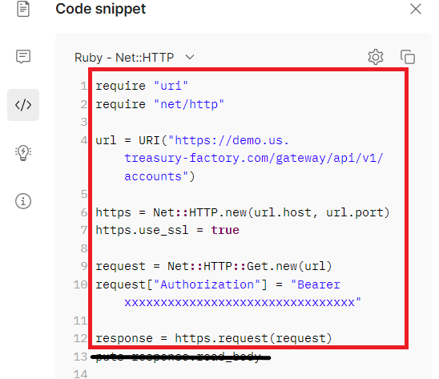
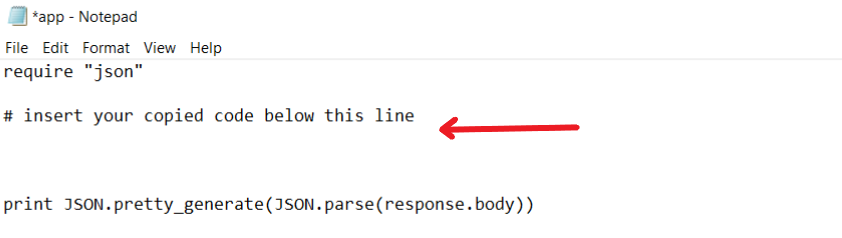

# basic-Ruby-Postman-App
## Requirements
Building the client library requires:
1.  Ruby 1.9.3 or higher [Installation][1]

[1]: https://www.ruby-lang.org/en/downloads/

> ⚠️  _Make sure that there is also added a variable to the PATH: [Ruby - Environment Setup][2]._
>
[2]: https://app.pluralsight.com/guides/how-to-set-up-a-ruby-development-environment


## Installation
To copy the client to your computer copy link of the repository, open Command Prompt, go to the location where project will be copied and execute git clone command:
```shell
git clone https://github.com/OlhaLevko/basic-Ruby-Postman-App.git
```
Open the project folder via command prompt, for example:
```shell
cd basic-Ruby-Postman-App
```
Select the desired Collection in Postman, authenticate through "Get token." request and run the request that you want to provide in the Application.
If the request works, copy code from Postman:


In "Code snippet", proceed to the dropdown list with different programming languages, where "cURL" is set by default, and choose "Ruby - Net::HTTP" from the list. There, copy the snippet without the last line:



Open the .../app.rb file with any text redactor and input your piece of code:




Run the project in Terminal in the root folder of cloned app:
```shell
ruby app.rb
```
If everything was done accordingly with provided steps, you will get the result printed in the command prompt.